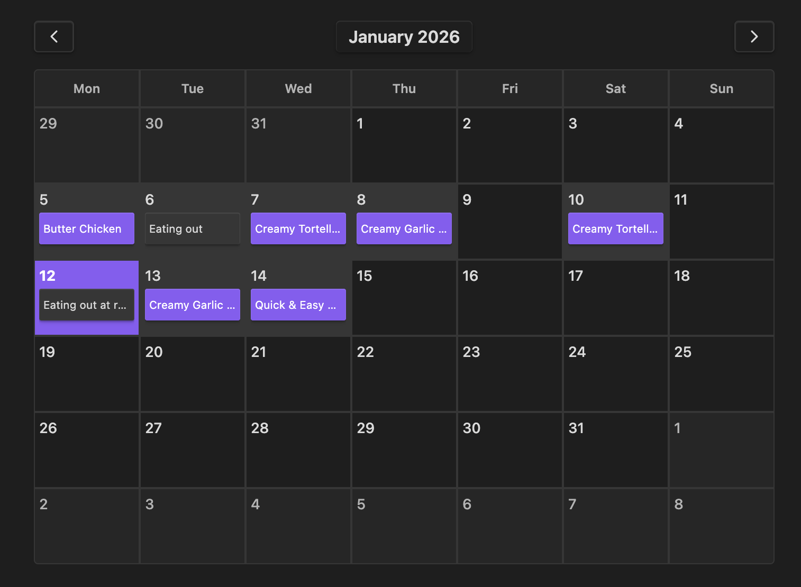
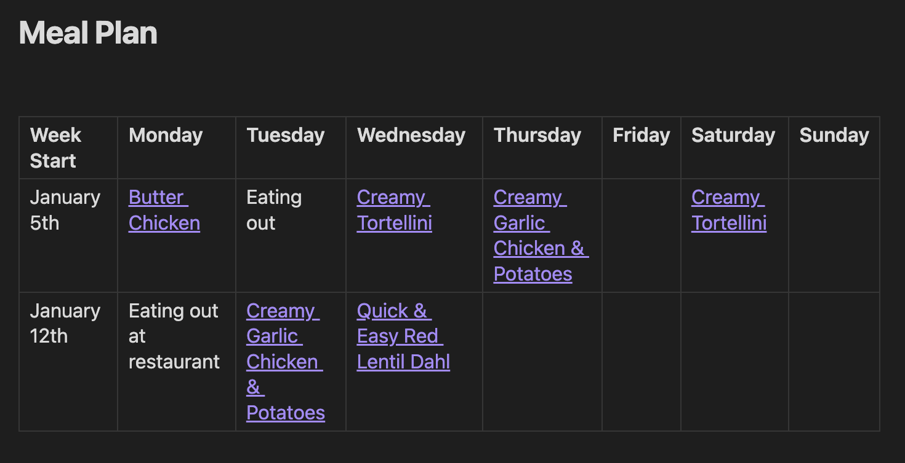

# Changelog

## Calendar View

### Added

-   A new calendar view feature that allows a visual calendar representation of the meal plan, and easily adding or removing recipes from the plan from this view. This will display at the top of the meal plan note.
-   Settings to enable or disable the calendar view feature.
-   The "Add to Meal Plan" button in the recipe context menu now uses the calendar view for date selection, instead of a dropdown list.
    -   This means you can now add recipes to dates more than a week in advance

### Changed

-   Refactored the meal plan note generation logic to accommodate the new calendar view feature.

## Meal Plan Table Format

### Added

-   A new format for storing the meal plan note data, using a markdown table instead of headings and lists. This may be easier to read and understand for some users.
-   A setting to choose between the new table format and the old heading/list format for the meal plan note.

